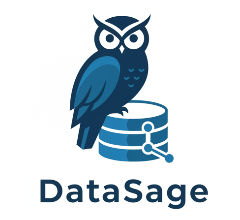

 [!WARNING]  
> **This project is currently in active development and may contain breaking changes.**  
> Updates and modifications are being made frequently, which may impact stability or functionality. This notice will be removed once development is complete and the project reaches a stable release.


# DataSage: Azure AI Question Answering System over SQL Data with LangGraph

{ width=150px }


## Overview

DataSage is a powerful question-answering system over tabular (SQL) data, leveraging Azure AI Foundry, LangGraph, Azure SQL DB, and Streamlit. This project enables users to interact with SQL databases through natural language queries, retrieving precise and contextually relevant answers powered by AI. The project is built off of the LangChain tutorial [Build a Question/Answering system over SQL data](https://python.langchain.com/docs/tutorials/sql_qa/).

The system integrates LangGraph to orchestrate multi-step workflows, Azure AI Foundry for model inference, and Azure SQL DB for structured data storage and retrieval. The front-end is built using Streamlit, providing an intuitive user experience for querying and exploring results.

Additionally, the project includes Bicep scripts for automated deployment of necessary Azure resources, ensuring a seamless and reproducible setup. 


## Key Features

- **Natural Language Querying:** Users can input questions in plain English, and the system converts them into SQL queries.

- **AI-Powered Responses:** Uses LLMs to interpret SQL results and generate human-readable answers.

- **LangGraph Integration:** Implements a structured, graph-based approach to managing AI workflows and SQL execution.

- **Azure AI Foundry:** Enhances question understanding and response generation.

- **Azure SQL DB:** Provides scalable and secure storage for structured data.

- **Streamlit UI:** A lightweight, interactive interface for querying and visualizing results.

- **Deployment:** Uses  Bicep to provision and configure Azure resources.

## Architecture

The architecture of DataSage consists of:

- **Frontend:** Built with Streamlit to provide a simple and effective UI for users to enter queries and visualize results.

- **Backend:** Powered by Python and LangGraph to parse queries, execute SQL commands, and generate responses using AI models.

- **Database:** Utilizes Azure SQL DB for storing and retrieving structured data.

- **AI Processing:** Azure AI Foundry processes and enhances the natural language interaction and response generation.

- **Infrastructure Automation:** Python and Bicep scripts deploy and configure required Azure resources.


## Requirements
- Azure subscription for deploying Azure GenAI RAG Application.
- [Azure CLI](https://learn.microsoft.com/en-us/cli/azure/get-started-with-azure-cli) (Command Line Interface)
- Python 3.11.4 installed on development environment.
- An IDE for Development, such as [VS Code](https://code.visualstudio.com/download)


## Usage

Follow these steps to set up and deploy the solution:

### 1. Clone the Repository from GitHub:  
Begin by cloning the repository to your local machine using the following command:

```bash
git clone https://github.com/jonathanscholtes/Azure-AI-RAG-Architecture-React-FastAPI-and-Cosmos-DB-Vector-Store.git
cd Azure-AI-RAG-Architecture-React-FastAPI-and-Cosmos-DB-Vector-Store
```

### 2. Deploy the Solution Using Bicep:  
Navigate to the deployment directory:

```bash
cd infra
```

Then, use the following PowerShell command to deploy the solution. Make sure to replace the placeholders with your actual subscription name, Azure Region (ResourceGroupLocation), Azure SQL DB username, and password:

**PowerShell**
```bash
.\deploy.ps1 -Subscription '[Subscription Name]' -Location 'eastus2' -SQLAdminUser '[User for SQL DB]' -SQLPassword '[Password to Create for SQL DB]'
```


## Clean-Up

After completing testing, ensure to delete any unused Azure resources or remove the entire Resource Group to avoid incurring additional charges.


## License
This project is licensed under the [MIT License](MIT.md), granting permission for commercial and non-commercial use with proper attribution.


## Disclaimer
This demo application is intended solely for educational and demonstration purposes. It is provided "as-is" without any warranties, and users assume all responsibility for its use.
